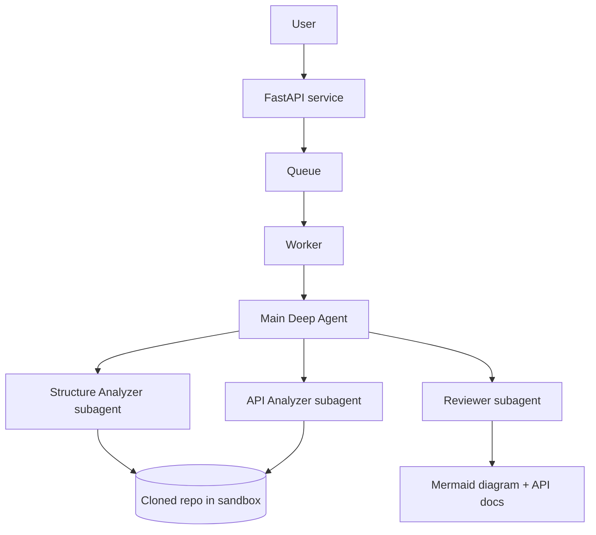

# code-artifacts-agent

An AI agent, built on [Deep Agents](https://academy.langchain.com/courses/foundation-introduction-to-deepagents), that analyzes a source code repository and generates artifacts from it.

**Goal:** give it a GitHub repo, and it produces

- a **Mermaid architecture diagram**
- **API documentation** (endpoints, request/response models)

The agent only *reads* the code it analyzes. It never executes it.

## Status

Work in progress (week 1 of an 8-week learning plan). Right now the repo contains the LLM fundamentals the rest of the project builds on.

| Done | Next |
| --- | --- |
| Calling an LLM with typed inputs and outputs (`llm_basics.py`) | Structured output with Pydantic |
| Token usage and temperature experiments | Tools, FastAPI service, streaming |

## Setup

Requires [uv](https://docs.astral.sh/uv/) and a [Groq](https://console.groq.com/keys) API key.

```
git clone https://github.com/salma-yasser/code-artifacts-agent.git
cd code-artifacts-agent
uv sync
```

Create a `.env` file in the project root (it is git-ignored, never commit it):

```
GROQ_API_KEY=your-key-here
```

## Run

```
uv run python llm_basics.py
```

This sends the same prompt three times at `temperature=0` and three times at `temperature=1`, and prints each reply with its input and output token counts.

To list the models your Groq key can use:

```
uv run python scripts/list_groq_models.py
```

## Project structure

```
llm_basics.py        # ask(): typed LLM call returning an LLMResponse
scripts/             # helper scripts
src/ai_service/      # service code (grows in later weeks)
pyproject.toml       # dependencies (managed with uv)
```

## Planned architecture



## Notes

Things learned along the way (added as I go).

**Temperature.** At `temperature=0` the same prompt gave the same answer in most runs, but not guaranteed to be identical every time. At `temperature=1` answers varied. Tests should not rely on exact text matches.

**Tokens.** Input and output token counts are reported separately. Token counts are higher than the visible text: the input includes extra tokens beyond my prompt, and reasoning models count their internal thinking as output tokens.
